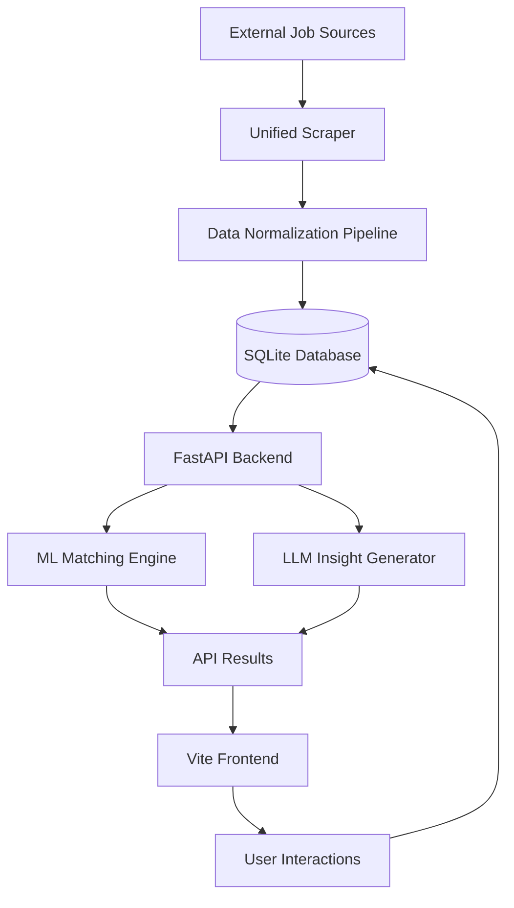

# JobSwap: An AI-Powered Career Matcher

[](https://github.com/blexyyyyy/jobswap/actions/workflows/test.yml)
[](https://www.python.org/downloads/)
[](https://opensource.org/licenses/MIT)

JobSwap is a modular, production-oriented career platform designed to modernize the job search experience through high-fidelity automation and machine learning. By integrating a swipe-based interface with advanced natural language processing and heuristic scoring, it provides a deterministic and observable pipeline for job discovery and application management.

> This project prioritizes systems design and architectural clarity over simple wrapper logic, demonstrating a robust integration of machine learning and large language models into a functional web application.

## 📽️ Demo

[](https://www.youtube.com/watch?v=OtCdinoW0cY)

## 🎬 Demo Walkthrough

The video above demonstrates the complete end-to-end flow of JobSwap:

*   **Real-Time Job Ingestion**: Aggregating live job data from multiple remote platforms (RemoteOK, Remotive, etc.) into a unified schema.
*   **Intelligent Scoring**: The ML engine (`LogisticMatchScorer`) analyzes the candidate's profile against job requirements to predict a match probability.
*   **AI-Powered Insights**: An LLM generates a clear, explainable "Why" for every match, highlighting specific skill overlaps or gaps.
*   **Interactive Interface**: A responsive, card-swiping UI that allows users to seamlessly save or skip opportunities based on data-driven recommendations.

## Quick Start
```bash
git clone https://github.com/blexyyyyy/jobswap.git
cd jobswap
pip install -r requirements.txt

# Run basic verification
pytest tests/

# Start backend
python app/main.py
```

## Key Capabilities

### Multi-Source Job Aggregation
The system features a unified scraping architecture that collects and normalizes data from multiple platforms, including Remotive, RemoteOK, and Jobicy, ensuring a consistent schema across disparate data sources.

### Heuristic and Logistic Match Scoring
Matches are calculated using a hybrid approach:
- **Logistic Regression**: Predicts match probability based on historical user behavior and profile features.
- **Skill Overlap Analysis**: Quantitative assessment of candidate technical stacks against job requirements.

### Generative AI Insights
Utilizes the Gemini Pro and Ollama-based models to generate high-fidelity explanations for match results. This addresses the "black box" problem of automated matching by providing candidates with actionable career feedback.

### Automated Resume Intelligence
A structured parsing engine extracts technical competencies, professional experience, and contact metadata from unstructured PDF and DOCX documents to automate profile generation.

### Event-Driven Swipe Interface
A high-performance frontend implementation utilizing card-stacking logic for efficient candidate-job interactions, with persistence layers for saves, skips, and applications.

## High-Level Architecture



## Core Design Principles

- **SOLID and Clean Architecture**: Clear separation between high-level business rules (Services) and low-level implementations (Database/Scrapers).
- **Dependency Inversion**: Utilization of abstractions for LLM providers (Gemini, Ollama, Groq) and data sources.
- **Deterministic Match Logic**: Ensuring that AI insights align with underlying ML scores.
- **Observability**: Comprehensive logging and test-driven verification for every stage of the ingestion and matching pipeline.

## System Components

### Backend Infrastructure
- **FastAPI**: Asynchronous API layer for low-latency job delivery and profile management.
- **Service Layer Pattern**: Business logic isolated in dedicated service classes for high testability.
- **JWT Security**: Secure session management with strict authentication boundaries.

### Matching and AI Layer
- **ML Scorer**: Feature engineering and logistic regression models for predicting user preferences.
- **Explanation Generator**: Strategic prompt engineering for contextual match analysis.
- **Vector Base (Ready)**: Architecture designed to support semantic search via ChromaDB integration.

### Frontend
- **Vanilla JavaScript (ES6+)**: High-performance, low-dependency code structure.
- **CSS3 Design System**: Glassmorphism aesthetics with modular stylesheets for consistent UI/UX.
- **Responsive Animations**: Optimized 60fps gesture-based interactions.

## End-to-End Workflow

1.  **Ingestion**: Scrapers fetch raw job data; the pipeline cleans and persists it to the database.
2.  **Profiling**: Users upload resumes; the parser extracts data to build a structured profile.
3.  **Discovery**: The API generates a job feed; the ML engine scores each job against the user profile.
4.  **Analysis**: On-demand AI insights provide the "Why" behind the match score.
5.  **Action**: User swipes are recorded; applications are tracked in the dashboard.

## Detailed Setup & Development

### Prerequisites
- Python 3.10 or higher
- Node.js (for frontend build)
- API Keys: Gemini Pro (optional but recommended for insights)

### Environment Setup
1. Clone the repository and navigate to the root directory.
2. Create and activate a virtual environment:
   ```bash
   python -m venv .venv
   .venv\Scripts\activate  # Windows
   source .venv/bin/activate  # Unix
   ```
3. Install dependencies:
   ```bash
   pip install -r requirements.txt
   ```
4. Configure environment variables in a `.env` file:
   ```env
   GEMINI_API_KEY=your_key_here
   JWT_SECRET=your_secret_key
   ```

### Execution
1. Start the FastAPI server (Database initializes automatically):
   ```bash
   python -m uvicorn app.main:app --reload
   ```
2. Access the application via `http://localhost:8000/frontend/index.html`.

## Testing and Verification

The system includes a suite of verification scripts to ensure component integrity:
- **Unit & Integration Tests**: `pytest tests/`
- **Scraper Verification**: `pytest tests/test_scrapers.py`

### Testing Notes (Windows)
When running the full test suite on Windows, you may encounter `asyncio` event loop errors (e.g., `RuntimeError: Event loop is closed`) due to known `pytest-asyncio` + `ProactorEventLoop` limitations. This **does not** affect CI (Linux) or production behavior. The `conftest.py` includes a workaround, but isolation issues may persist locally.

## Project Status

- **Core Engine**: Stable
- **Matching Pipeline**: Fully Integrated
- **Auth System**: Production Ready
- **Frontend**: Functional (Vite build ready)
- **Planned**: Persistent vector search refinement and automated application delivery.

## License
MIT
